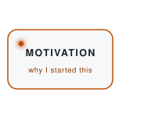
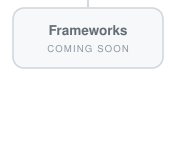
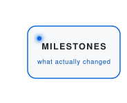

<a href="projects/Claude-Masterclass/"><picture><source media="(prefers-color-scheme: dark)" srcset="assets/map/dark/tile-claude.svg"></picture></a><a href="projects/"><picture><source media="(prefers-color-scheme: dark)" srcset="assets/map/dark/tile-core.svg"></picture></a><a href="projects/AWS-AI-Practitioner/"><picture><source media="(prefers-color-scheme: dark)" srcset="assets/map/dark/tile-aws.svg"></picture></a><a href="text-view.md"><picture><source media="(prefers-color-scheme: dark)" srcset="assets/map/dark/tile-textview.svg"></picture></a>

<a href="motivation.md"><picture><source media="(prefers-color-scheme: dark)" srcset="assets/map/dark/tile-motivation.svg"></picture></a><picture><source media="(prefers-color-scheme: dark)" srcset="assets/map/dark/tile-frameworks.svg"></picture><a href="milestones.md"><picture><source media="(prefers-color-scheme: dark)" srcset="assets/map/dark/tile-milestones.svg"></picture></a><picture><source media="(prefers-color-scheme: dark)" srcset="assets/map/dark/tile-spacer.svg"></picture>

