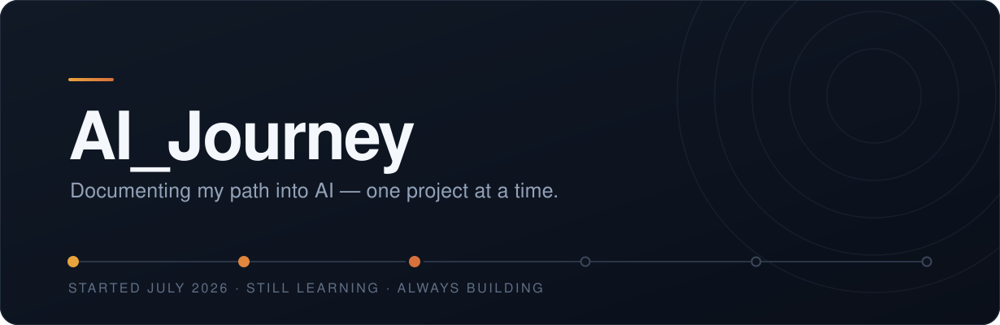

  

 

> [!NOTE]
> **Right now** — Section 8 of 14, building AI agents with Claude Code · **80 of 158 lessons** · AWS Cloud 101 passed, chasing the AI Practitioner certification

### 🧭 What this is

My personal log. Whenever I pick up something new — a tool, a course, a certification, an idea worth building — it gets a folder here and a dated record of how it actually went.

I started with Claude, because that is where the door opened. Where it goes next depends on what turns out to be worth learning.

### 📚 Projects

| | Project | Where it stands |
|:--|:--|:--|
| 🤖 | **[Claude Masterclass](projects/Claude-Masterclass/)** Claude Code, Cowork, Skills and agents — a 158-lesson course | Section 8 of 14 80 lessons watched |
| ☁️ | **[AWS AI Practitioner](projects/AWS-AI-Practitioner/)** The road to the AIF-C01 certification, via AWS Educate | Cloud 101 passed waiting on the exam voucher |

This list is meant to grow. New projects get added as I find them.

### 🎯 What I'm learning

**Claude Code & Cowork** — the daily driver, and the reason this repo exists 
**AI agents** — state, tools, memory, and why a loop beats a one-shot prompt 
**AWS** — the cloud vocabulary, on the way to a certification 
**Git and GitHub** — every day; this repository is the practice ground 
**Python** — next up, once the agent chapters start asking for it

### 🏁 Milestones

| When | What happened |
|:--|:--|
| **24 Aug 2026** | Passed AWS Cloud 101 on the first try — 73.3 % |
| **20 Aug 2026** | Finished Section 7: a calorie tracker app built end to end with Claude Code |
| **16 Aug 2026** | Finished Section 6, the biggest chapter — Claude Code foundations |
| **26 Jul 2026** | Set up this repository; learned add → commit → push |
| **21 Jul 2026** | Started the course |

### 🗂️ How this repository works

Every project lives in its own folder under `projects/`, holding three files:

`README.md` — what the project is and where it stands 
`study-plan.md` — where it is going, and whether I am on schedule 
`progress.md` — dated entries, newest first

> [!TIP]
> Nothing here is backdated and nothing is tidied up afterwards. The pace in `progress.md` is the real one — about 19 minutes a day against a 30-minute target — not the one I wish I had.
