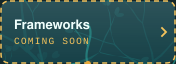
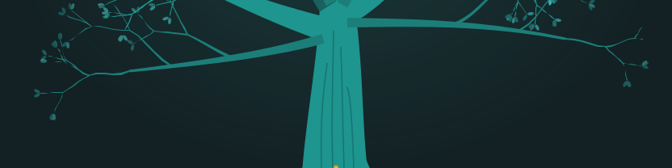
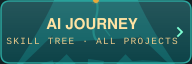

<p align="center">
<a name="map-1"></a><br>
<a name="map-2"></a><a href="projects/"></a><a name="map-3"></a><br>
<a name="map-4"></a><br>
<a name="map-5"></a><a href="projects/"></a><a name="map-6"></a><br>
<a name="map-7"></a><a href="projects/"></a><a name="map-8"></a><a href="projects/"></a><a name="map-9"></a><br>
<a name="map-10"></a><a href="projects/"></a><a name="map-11"></a><br>
<a name="map-12"></a><br>
<a name="map-13"></a><a href="projects/AWS-AI-Practitioner/"></a><a name="map-14"></a><br>
<a name="map-15"></a><a href="projects/Claude-Masterclass/"></a><a name="map-16"></a><a href="projects/AWS-AI-Practitioner/"></a><a name="map-17"></a><br>
<a name="map-18"></a><a href="projects/Claude-Masterclass/"></a><a name="map-19"></a><br>
<a name="map-20"></a><br>
<a name="map-21"></a><a href="projects/"></a><a name="map-22"></a><br>
<a name="map-23"></a><br>
<a name="map-24"></a><a href="motivation.md"></a><a name="map-25"></a><a href="milestones.md"></a><a name="map-26"></a><a href="text-view.md"></a><a name="map-27"></a><br>
<a name="map-28"></a>
</p>

### <a name="leaf-1"></a> &nbsp;Repository structure

```
AI_Journey/
├── README.md                 the skill tree, this page
├── text-view.md              the same page in plain text
├── motivation.md             why I started this
├── milestones.md             what actually changed along the way
├── projects/
│   ├── README.md             every project: running, finished, queued
│   ├── AWS-AI-Practitioner/
│   │   ├── README.md         what it is and where it stands
│   │   ├── study-plan.md     where it is going
│   │   ├── progress.md       dated entries, newest first
│   │   └── certificate.png   the proof, once it is earned
│   └── Claude-Masterclass/   the same four files
└── assets/                   the tree, the page headers and the heading leaves, all self-hosted
```

Every project gets its own folder with the same files, created on the day the work starts.
