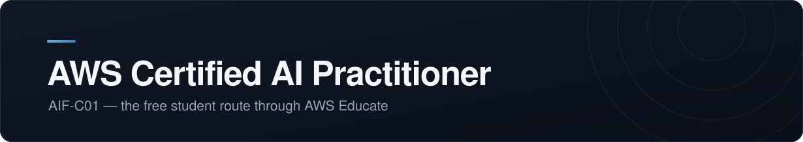

  

 

> [!NOTE]
> <!-- STATUS:START -->
> **2 of 5 steps done** 
> **Cloud 101 passed** — 73.3 % on the first try, badge claimed 
> **Waiting** — the Emerging Talent Community can take up to 72 hours to unlock 
> **Next up** — earn points toward an exam voucher
> <!-- STATUS:END -->

Part of my [AI Journey](../../README.md).

### 🎯 The goal

Earn the AWS Certified AI Practitioner certification — ideally free, as a student, through the AWS Educate voucher route.

### 🛣️ The road

| | Step | |
|:--|:--|:--|
| ✓ | **A** — Create an AWS Educate account | done |
| ✓ | **B** — Complete *Cloud 101* and its assessment, earn the badge | done |
| ▸ | **C** — Unlock and onboard the Emerging Talent Community | **here now** |
| · | **D** — Earn points, redeem an exam voucher | ahead |
| · | **E** — Book and pass the AIF-C01 exam | ahead |

> [!TIP]
> Everything on this road is free. The voucher is earned with points from the Emerging Talent Community, not bought — which is the whole reason for taking this route rather than paying for the exam outright.

### 🗂️ The files here

[`progress.md`](./progress.md) — dated entries: what I studied and what stuck 
[`study-plan.md`](./study-plan.md) — the four-week plan and what each week covers
