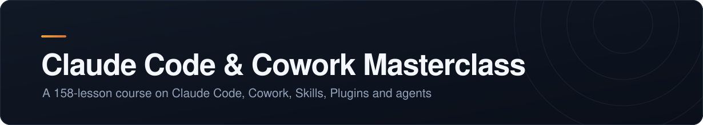

  

 

> [!NOTE]
> <!-- STATUS:START -->
> **80 of 158 lessons** — 80 of the 132 I actually plan to watch 
> **Section 8 of 14** — Claude Code for Building AI Agents 
> **About 19 minutes a day**, against a 30-minute target 
> **Next up** — L107, Personal Finance AI Agents with No Memory
> <!-- STATUS:END -->

Part of my [AI Journey](../../README.md). The course is *"The Complete Claude Code & Claude Cowork Masterclass [2026]"* by Prof. Ryan Ahmed.

### 🎯 The goal

Get genuinely fluent with Claude Code, Cowork, Skills and Plugins — and build real things with them, not just watch someone else do it.

### 📖 Sections

| | Section | |
|:--|:--|:--|
| ✓ | **1–3** — Intro, Cowork, Skills and Plugins, Claude Chat Mastery | done |
| ✓ | **6** — Claude Code Foundations *(the biggest chapter)* | done |
| ✓ | **7** — Claude Code for Building Apps | done |
| ▸ | **8** — Claude Code for Building AI Agents | **here now** |
| · | **9–11** — Build and set up a personal AI agent | ahead |
| · | **12–14** — Automations: sprint tracker, CRM, email triage and more | ahead |
| ✗ | **4–5** — Claude in Excel and PowerPoint | skipped |

> [!TIP]
> Sections 4 and 5 are skipped on purpose — less interested in the Microsoft-tool workflows, more into the Claude Chat and Claude Code chapters. I can always come back. That leaves **132 target lessons of 158**.

### 🗂️ The files here

[`progress.md`](./progress.md) — dated entries: what I watched and what I took from it 
[`study-plan.md`](./study-plan.md) — milestones, time remaining, and whether I am actually on schedule
