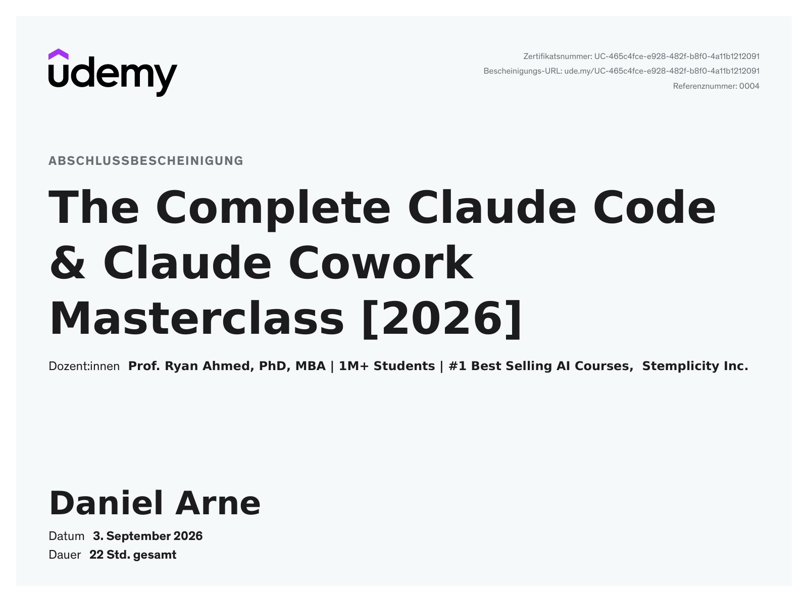

# Claude Code & Cowork Masterclass

Working through *"The Complete Claude Code & Claude Cowork Masterclass [2026]"* by Prof. Ryan Ahmed — part of my [AI Journey](../../README.md).

<!-- STATUS:START -->
🟢 &nbsp;158 of 158 lessons — course complete
<!-- STATUS:END -->

---

### 🟧 &nbsp;The goal

Get genuinely fluent with Claude Code, Cowork, Skills and Plugins — and build real things with them, not just watch someone else do it.

### 🟥 &nbsp;Where this stands

<!-- STATE:START -->
**Completed 2026-09-03** 
**158 of 158 lessons** — every lesson watched, including Sections 4 and 5 once the Excel/PowerPoint add-in rights issue cleared 
**All ten automation blueprints built and tested** — sprint tracker through weekly executive reporting
<!-- STATE:END -->

### 🟪 &nbsp;Sections

| | Section | Status |
|---|---|---|
| 1–3 | Intro, Cowork, Skills and Plugins, Claude Chat Mastery | **Done** |
| 4–5 | Claude in Excel and PowerPoint | **Done** |
| 6 | Claude Code Foundations — the biggest chapter | **Done** |
| 7 | Claude Code for Building Apps | **Done** |
| 8 | Claude Code for Building AI Agents | **Done** |
| 9–10 | Personal AI agent: intro and architecture | **Done** |
| 11 | Set up your personal AI agent | **Done** |
| 12 | Automations: sprint tracker, market pulse, morning brief | **Done** |
| 13 | Automations: research teams, CRM, meeting intel, email triage | **Done** |
| 14 | Automations: expense wrangler, content machine, weekly exec | **Done** |

Sections 4 and 5 were skipped on purpose at the time: the Claude Code and agent chapters were the reason I bought the course, and the Microsoft-tool workflows could wait. I came back to them on 31 August and could not get in — the add-in needed rights I did not have on that machine, and it did not appear inside the application either. Once that cleared, both sections played through in a single sitting.

The plan I set myself was met on 30 August, and the whole course followed on 3 September. The front page counts what is
actually watched: **158 of 158**.

### 🟦 &nbsp;The certificate

**Issued 3 September 2026** — the day sections 4 and 5 were watched and the course closed out 
**Certificate number UC-465c4fce-e928-482f-b8f0-4a11b1212091** — printed on the certificate itself, so it can be checked without this page linking anywhere 
**It reads 22 hours** — that is the course's listed length; the 19h 07 in the [study plan](./study-plan.md) is the sum of the lesson times I logged 
**The document is German** — that is how Udemy issued it; everything written around it stays English

### ⬜ &nbsp;The files here

[`progress.md`](./progress.md) — dated entries: what I watched and what I took from it 
[`study-plan.md`](./study-plan.md) — what was planned, what happened, and what I would plan differently 
[`certificate.png`](./certificate.png) — the completion certificate, shown above
